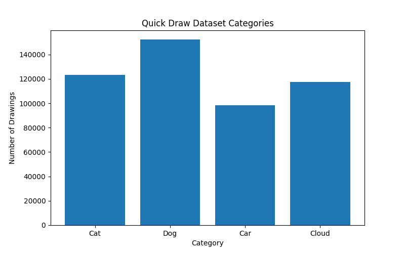

# Quick Draw Dataset Exploration

## Project Overview

This project explores categories from Google's Quick Draw dataset using Python and data visualization.

The goal was to compare the number of drawings available for several categories and visualize the differences using a bar chart.

## Dataset

Source: Google Quick Draw Dataset

Categories analyzed:

- Cat
- Dog
- Car
- Cloud

## Technologies Used

- Python
- Matplotlib
- Git
- GitHub

## Results

The dataset contains the following numbers of drawings:

| Category | Number of Drawings |
|----------|-------------------|
| Dog | 152,159 |
| Cat | 123,202 |
| Cloud | 117,587 |
| Car | 98,331 |

### Visualization

### Key Findings

- Dog is the most frequently drawn category.
- Car has the fewest drawings among the selected categories.
- Cat and Cloud have similar numbers of drawings.
- The chart clearly shows the distribution differences between categories.

## Author

Alina Musteata